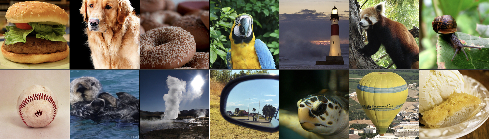

## FreeFlow: Flow Map Distillation Without Data<br><sub>Official PyTorch Implementation</sub>

### [Paper](https://arxiv.org/abs/2511.19428/) | [Project Page](https://data-free-flow-distill.github.io/)



This repo contains PyTorch model definitions, pre-trained weights and sampling code for our paper.

> [**Flow Map Distillation Without Data**](https://arxiv.org/abs/2511.19428/)<br>
> [Shangyuan Tong<sup>1,*</sup>](https://shangyuantong.github.io/), [Nanye Ma<sup>2,*</sup>](https://willisma.github.io/), [Saining Xie<sup>2,†</sup>](https://www.sainingxie.com/), [Tommi Jaakkola<sup>1,†</sup>](https://people.csail.mit.edu/tommi/)
> <br><sup>1</sup>Massachusetts Institute of Technology, <sup>2</sup>New York University<br>
> <sup>*</sup>Equal contribution, <sup>†</sup>Equal advising

State-of-the-art flow models achieve remarkable quality but require slow, iterative sampling. To accelerate this, flow maps can be distilled from pre-trained teachers, a procedure that conventionally requires sampling from an external dataset. We argue that this data-dependency introduces a fundamental risk of **Teacher-Data Mismatch**, as a static dataset may provide an incomplete or even misaligned representation of the teacher's full generative capabilities. This leads us to question whether this reliance on data is truly necessary for successful flow map distillation. In this work, we explore a data-free alternative that samples only from the prior distribution—a distribution the teacher is guaranteed to follow by construction, thereby circumventing the mismatch risk entirely. To demonstrate the practical viability of this philosophy, we introduce a principled framework that learns to predict the teacher's sampling path while actively correcting for its own compounding errors to ensure high fidelity. Our approach surpasses all data-based counterparts and establishes a new state-of-the-art by a significant margin. Specifically, distilling from SiT-XL/2+REPA, our method reaches an impressive FID of **1.45** on ImageNet 256x256, and **1.49** on ImageNet 512x512, both with only 1 sampling step. We hope our work establishes a more robust paradigm for accelerating generative models and motivates the broader adoption of flow map distillation without data.

## Setup

We provide an [`environment.yml`](environment.yml) file that can be used to create a Conda environment. If you only want
to run pre-trained models locally on CPU, you can remove the `cudatoolkit` and `pytorch-cuda` requirements from the file.

```bash
conda env create -f environment.yml
conda activate DiT
```


## Sampling [](https://huggingface.co/nyu-visionx/FreeFlow/tree/main)


**Pre-trained FreeFlow checkpoints.** You can sample from our pre-trained models with [`sample.py`](sample.py). Weights for our pre-trained models are hosted on [huggingface space](https://huggingface.co/nyu-visionx/FreeFlow/tree/main). To use them, visit the huggingface download [guide](https://huggingface.co/docs/huggingface_hub/en/guides/download), and pass the file path to the script, as shown below.

The script allows switching between the 256x256
and 512x512 models and change the classifier-free guidance scale, etc. For example, to sample from
our 512x512 FreeFlow-XL/2 model, you can use:

```bash
python sample.py --image-size 512 --seed 1 --ckpt <ckpt-path>
```

## Evaluation (FID, Inception Score, etc.)

We include a [`sample_ddp.py`](sample_ddp.py) script which samples a large number of images in parallel. This script
generates a folder of samples as well as a `.npz` file which can be directly used with [ADM's TensorFlow
evaluation suite](https://github.com/openai/guided-diffusion/tree/main/evaluations) to compute FID, Inception Score and
other metrics. For example, to calculate FID-50K,

```bash
torchrun --nnodes=1 --nproc_per_node=N sample_ddp.py --num-fid-samples 50000 --ckpt <ckpt-path>
```

There are several additional options; see [`sample_ddp.py`](sample_ddp.py) for details.


## Differences from JAX

Our models were originally trained in JAX on TPUs. The weights in this repo are ported directly from the JAX models.
There may be minor differences in results stemming from sampling with different floating point precisions.


<!-- ## BibTeX

```bibtex
@article{Peebles2022DiT,
  title={Scalable Diffusion Models with Transformers},
  author={William Peebles and Saining Xie},
  year={2022},
  journal={arXiv preprint arXiv:2212.09748},
}
``` -->


## Acknowledgments
We are grateful to Kaiming He for valuable discussions and feedback on the manuscript.

This codebase mostly builds upon the DiT [repo](https://github.com/facebookresearch/DiT).


## License
The code and model weights are licensed under MIT. See [`LICENSE`](LICENSE) for details.
